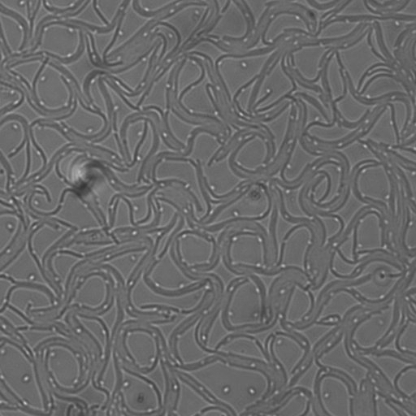
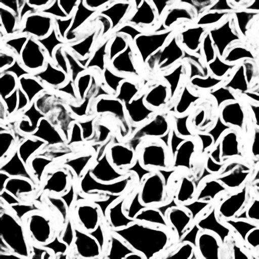
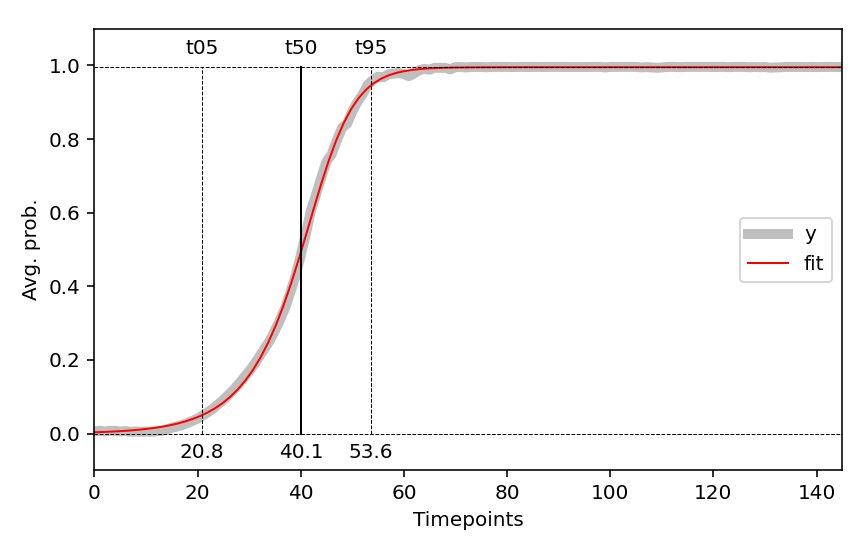

## Usage


  


### `main.py`

#### Procedure

- **extract()**  
Extract and save cropped movies as `..._stk.tif` in the `outputs` 
directory.

- **predict()**  
Batch read `..._stk.tif`, predict segmentation masks.  
Predictions are saves as `..._prd.tif` in the `outputs` directory.

- **fit()**  
Measure avg. predictions (probabilities) over time and fit using L5P.  
Fit data are saved as `..._fit-data.pkl` in the `outputs` directory.  
Fit plots are saved as `..._fit-plot.png` in the `outputs` directory.  
L5P (Five Parameters logistic regression)

- **analyse()**  
Merge and average fit data per condition (distance & alignement).  
Merge data are saved as `..._merged-data.pkl/csv` in the `outputs` directory.   
Merge plots are saved as `..._merged-plot.png` in the `outputs` directory. 

#### Parameters
```bash
- data_path  # str, path to the data directory
- model_name # str, model name for predictions (model should be in root)
- sampling   # int, temporal sampling (1 = all frames, n = every [n]th frames)
- crop_size  # int, size in pixels of the central cropped region
```

#### Outputs
```bash
# One per movie:
- ..._stk.tif       # uint8, cropped movie
- ..._prd.tif       # uint8, cropped movie predictions
- ..._fit-data.pkl  # fit data (read with pickle Python module)
- ..._fit-plot.png  # fit data plot overview

# One for all:
- 0_merged-data.pkl # merged data (read with pickle Python module)
- 0_merged-data.csv # selected data saved as CSV
    - dst           # bacteria laying distance
    - alg           # bacteria laying alignement
    - t05_avg/std   # time of 05% of max avg. prob. (from fit)
    - t50_avg/std   # time of 50% of max avg. prob. (from fit)
    - t95_avg/std   # time of 95% of max avg. prob. (from fit)
- 0_merged-plot.png # merged data plot overview
```

### `extract.py`
Extract random patches from dataset.  

### `train.py`
Annotate extracted patches & train DL model (U-Net with resnet18 encoder). 
